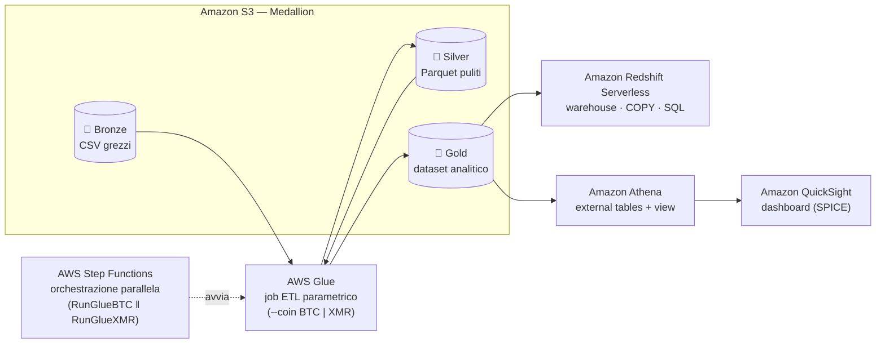

# CryptoData Insights — Pipeline E2E su AWS per l'analisi di BTC e XMR

Pipeline di Data Engineering **End-to-End su AWS** che ingerisce, pulisce e arricchisce i
dati di mercato di Bitcoin (BTC) e Monero (XMR), correlando il prezzo giornaliero con
l'interesse di ricerca settimanale di Google Trends e rendendo i risultati interrogabili
su data warehouse e dashboard.

> 📄 **[Leggi il report completo del progetto (PDF)](./Report_Progetto9.pdf)**
> — architettura, scelte implementative, codice e screenshot delle esecuzioni AWS.

Progetto del **Master in Data Engineering** di ProfessionAI (corso *Cloud Data Engineering con AWS*).

---

## 🎯 Obiettivo

In un mercato volatile come quello delle criptovalute, disporre di dati puliti, arricchiti e
tempestivi è decisivo. Il progetto costruisce un'infrastruttura cloud **completamente serverless**
che trasforma quattro file CSV grezzi in un dataset analitico unico per valuta, pronto per
query SQL e visualizzazione, automatizzando l'intero flusso dall'ingestione alla dashboard.

## 🏗️ Architettura

Lo storage segue la **Medallion Architecture** (Bronze → Silver → Gold) su Amazon S3; un unico
job Glue parametrico processa entrambe le valute, orchestrato in parallelo da Step Functions.



| Layer | Servizio | Ruolo |
|-------|----------|-------|
| **Storage** | Amazon S3 (Bronze/Silver/Gold) | Source of truth a livelli, formato Parquet |
| **Processing / ETL** | AWS Glue (PySpark) | Pulizia, media mobile 10gg, join prezzo↔trend |
| **Orchestrazione** | AWS Step Functions | Esecuzione parallela BTC ‖ XMR con gestione errori |
| **Data Warehouse** | Amazon Redshift Serverless | Caricamento via `COPY` e query analitiche |
| **BI / Visualization** | Amazon QuickSight (via Athena) | Dashboard interattive sul Gold layer (pattern Lakehouse) |

## ⚙️ Logica della pipeline (ETL Glue)

Un **singolo Glue Job parametrico** (`--coin BTC|XMR`) evita la duplicazione del codice e
gestisce l'intero ciclo del dato:

- **Pulizia prezzi (Silver):** parsing date `MM/dd/yyyy`, rimozione separatori di migliaia,
  cast a `double`, e **forward-fill** dei valori mancanti (sentinel `-1`) ordinato per data.
- **Normalizzazione trend:** selezione dinamica della colonna metrica (i due file Google Trends
  hanno nomi diversi: `interesse bitcoin` vs `Monero_interesse`) e calcolo della chiave
  settimanale `week_start` via `date_trunc("week", ...)`.
- **Arricchimento (Gold):** **media mobile a 10 giorni** sui prezzi e **join temporale robusto**
  prezzo↔trend sulla settimana di appartenenza; i trend mancanti restano `NULL` per preservare
  la distinzione semantica fra assenza di dato e valore zero.

**Schema finale (Gold):** `date`, `price`, `coin`, `moving_avg_10d`, `trend_score`.

## 💾 Dati

Una coppia di file per valuta — storico prezzi giornaliero (BTC/EUR, XMR/EUR) e Google Trends
settimanale — in [`data/raw/`](./data/raw). Dataset originale:
[Google Drive](https://drive.google.com/drive/folders/1q-6IWRebAe51xhhY_dWI5QWfiBWEH8E2).

## 🛠️ Stack

`AWS S3` · `AWS Glue (PySpark)` · `AWS Step Functions` · `Amazon Redshift Serverless` ·
`Amazon Athena` · `Amazon QuickSight` · `IAM` (ruoli a privilegio minimo)

## 📄 Il report

Il deliverable del progetto è il **report tecnico** in [`Report_Progetto9.pdf`](./Report_Progetto9.pdf):
documenta passo per passo l'infrastruttura realizzata sulla console AWS, con codice (PySpark,
Amazon States Language, SQL) e screenshot a riprova delle esecuzioni andate a buon fine.

Il report è scritto in [Typst](https://typst.app/) (sorgenti in [`src/`](./src)) e si rigenera con:

```powershell
.\build.ps1
```

> Nota: gli ARN nel report usano un Account ID AWS fittizio (`123456789012`).
